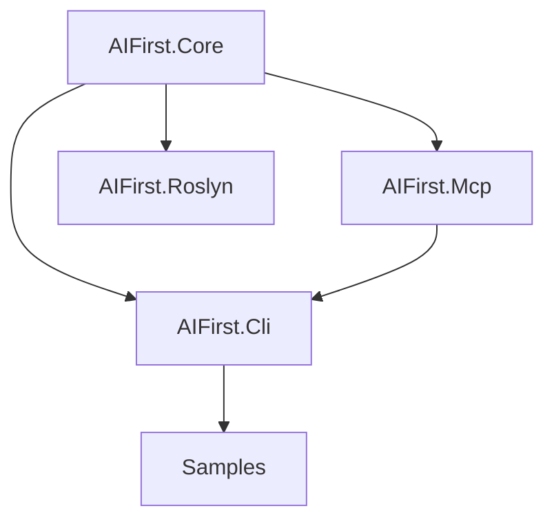

# Design

## Overview

AIFirst.CSharp provides a C#-native DSL for calling MCP tools with compile-time validation and governance. The MVP focuses on an attribute-based DSL that becomes strongly-typed tool calls via a Roslyn source generator and analyzer.

## Architecture

## Key components

- **AIFirst.Core**
  - Tool contracts, policy pipeline, and tracing primitives.
- **AIFirst.Mcp**
  - MCP client adapter for tool discovery and invocation.
- **AIFirst.Roslyn**
  - `[Tool]` attribute, source generator, and analyzer rules.
- **AIFirst.Cli**
  - `pull-tools`, `gen`, and `replay` commands.

## Tool manifest lifecycle

1. `aifirst pull-tools` connects to an MCP server.
2. Tool schemas are captured in `aifirst.tools.json`.
3. `aifirst gen` generates C# DTOs for tool parameters and results.
4. The Roslyn generator/analyzer uses the manifest for build-time validation.

## Policy pipeline ordering

Policies execute in the following order:

1. `OnBeforeToolCall` (allowlist, redaction, validation)
2. MCP tool invocation
3. `OnAfterToolCall` (output safety checks, audit logging)

## Trace format (MVP)

Each trace event includes:

- `kind` (prompt/tool/trace)
- `timestamp`
- `payloadJson`

The CLI will write JSON traces to disk and support replay.
