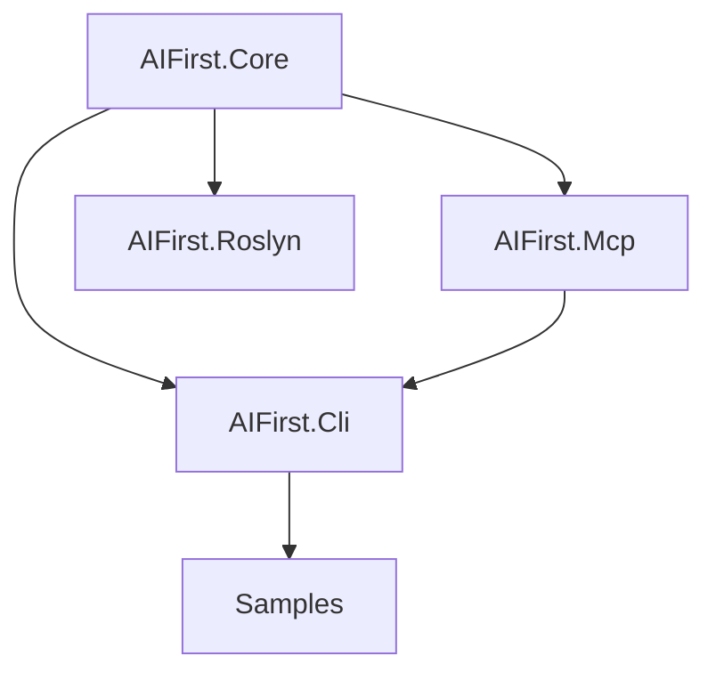

# Design

## Overview

AIFirst.DotNet provides a C#-native DSL for calling MCP tools with compile-time validation and governance. The MVP focuses on an attribute-based DSL that becomes strongly-typed tool calls via a Roslyn source generator and analyzer.

## Architecture

## Key Components

### AIFirst.Core
- **Tooling**: `ToolContract`, `ToolCall`, `ToolResult` records
- **Schema**: `JsonSchema`, `JsonSchemaParser`, `CSharpTypeMapper`
- **CodeGen**: `DtoGenerator` for C# record generation
- **Policies**: `IPolicy`, `PolicyPipeline` for governance
- **Tracing**: `TraceEvent`, `ITraceSink` for observability

### AIFirst.Mcp
- **Client**: `McpClient` with JSON-RPC 2.0 protocol
- **Transport**: `IMcpTransport`, `StdioMcpTransport`
- Tool discovery via `tools/list`
- Tool invocation via `tools/call`

### AIFirst.Roslyn
- `[Tool]` attribute for marking tool methods
- Source generator (in progress)
- Analyzer rules (in progress)

### AIFirst.Cli
- `aifirst pull-tools` - Connect to MCP server and save manifest
- `aifirst gen` - Generate C# DTOs from tool manifest
- `aifirst replay` - Replay traces (planned)

## Tool Manifest Lifecycle

1. `aifirst pull-tools` connects to an MCP server
2. Tool schemas are captured in `aifirst.tools.json`
3. `aifirst gen` generates C# DTOs for tool parameters
4. The Roslyn generator/analyzer uses the manifest for build-time validation

## JSON Schema Support

The schema parser handles:
- Primitive types: string, integer, number, boolean
- Complex types: object, array
- Format hints: date-time, uri, uuid, guid
- Nullability via `nullable` property
- Required vs optional properties
- Nested objects and arrays
- `$ref` references

## Policy Pipeline Ordering

Policies execute in the following order:

1. `OnBeforeToolCall` (allowlist, redaction, validation)
2. MCP tool invocation
3. `OnAfterToolCall` (output safety checks, audit logging)

## Trace Format (MVP)

Each trace event includes:

- `kind` (prompt/tool/trace)
- `timestamp`
- `payloadJson`

The CLI will write JSON traces to disk and support replay.
